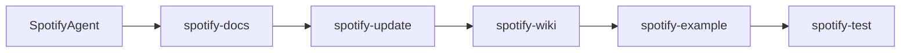

# Spotify Project Custom Agents & Skills

This folder contains specialized AI agents and skills for the EC.Spotify project. The project uses a **skill-based workflow** where each step of the maintenance process is a reusable skill that can be invoked individually or as part of an orchestrated workflow.

## Architecture Overview



**SpotifyAgent**: Master orchestrator that coordinates the 5 specialized skills in sequence.

**5 Skills**: Each skill handles one step of the maintenance workflow and can be run independently.

## Available Skills

### 📚 spotify-docs

**Location**: `.github/skills/spotify-docs/SKILL.md`

**Purpose**: Generate and maintain Spotify API documentation.

**When to Use**:
- Running `/spotify docs`
- API documentation needs refreshing
- Before running other skills in the workflow

**Capabilities**:
- Fetch latest Spotify Web API documentation
- Generate API method summary tables
- Track deprecation status and permissions
- Maintain PowerShell generation scripts
- Validate documentation structure

**Example Commands**:
```
/spotify docs                    # Run docs skill
/spotify docs --force           # Force regeneration
```

---

### 🔧 spotify-update

**Location**: `.github/skills/spotify-update/SKILL.md`

**Purpose**: Update EC.Spotify library code to match Spotify API documentation.

**When to Use**:
- Running `/spotify update`
- After Spotify API changes
- Before running Wiki, Examples, or Tests skills

**Capabilities**:
- Update service interfaces and implementations
- Add/remove methods based on API changes
- Mark deprecated methods as `[Obsolete]`
- Update OAuth scopes in configuration
- Validate build after changes

**Example Commands**:
```
/spotify update                  # Run update skill
/spotify update --validate      # Run with build validation
```

---

### 📖 spotify-wiki

**Location**: `.github/skills/spotify-wiki/SKILL.md`

**Purpose**: Generate Wiki documentation from library source code.

**When to Use**:
- Running `/spotify wiki`
- After library code changes
- Before running Examples or Tests skills

**Capabilities**:
- Generate service reference pages
- Document models and enums
- Create configuration guides
- Add usage examples
- Maintain Wiki structure

**Example Commands**:
```
/spotify wiki                    # Run wiki skill
/spotify wiki --full            # Full regeneration
```

---

### 💻 spotify-example

**Location**: `.github/skills/spotify-example/SKILL.md`

**Purpose**: Create example code and HTTP files demonstrating library usage.

**When to Use**:
- Running `/spotify examples`
- After library code changes
- To provide testable API examples

**Capabilities**:
- Generate controller examples
- Create HTTP request files
- Document all service methods
- Define variables and templates
- Validate example builds

**Example Commands**:
```
/spotify examples                # Run examples skill
/spotify examples --validate    # Run with build validation
```

---

### 🧪 spotify-test

**Location**: `.github/skills/spotify-test/SKILL.md`

**Purpose**: Create and maintain unit and integration tests.

**When to Use**:
- Running `/spotify tests`
- After library code changes
- Before releasing new versions

**Capabilities**:
- Generate unit tests with Moq
- Create integration tests
- Update mock implementations
- Maintain test data fixtures
- Generate coverage reports

**Example Commands**:
```
/spotify tests                   # Run tests skill
/spotify tests --coverage       # Run with coverage report
```

---

## Running the Full Workflow

The **SpotifyAgent** orchestrates all 5 skills in sequence. You can invoke it directly:

### Interactive Mode (default)
```
/spotify workflow
```
Prompts before each skill, shows detailed progress, stops on errors.

### Automated Mode
```
/spotify workflow --auto
```
Runs all skills without prompts. Use when confident in current state.

### Dry Run
```
/spotify workflow --dry-run
```
Shows what would happen without making changes.

### Resume from Specific Skill
```
/spotify resume --from Spotify-Wiki
```
Starts from the specified skill, skipping completed ones.

### Schedule

- **Weekly**: Run docs skill only
  ```
  /spotify docs
  ```

- **Monthly**: Run full workflow
  ```
  /spotify workflow
  ```

- **After API Changes**: Run full workflow immediately
  ```
  /spotify workflow --auto
  ```

### Validation

After workflow completes, validate:

```powershell
# Build solution
dotnet build src\EC.Spotify\EC.Spotify.slnx

# Run tests
dotnet test src\EC.Spotify\EC.Spotify.UnitTests\EC.Spotify.UnitTests.csproj

# Start API example
dotnet run --project src\EC.Spotify\EC.Spotify.ApiExample\EC.Spotify.ApiExample.csproj
```

### Logs

All workflow runs are logged to:
```
.github\logs\YYYY-MM-DD_HH-MM-SS\
```

---

## Skill Invocation Reference

### Individual Skill Commands

| Command | Description |
|---------|-------------|
| `/spotify docs` | Run spotify-docs |
| `/spotify update` | Run spotify-update |
| `/spotify wiki` | Run spotify-wiki |
| `/spotify examples` | Run spotify-example |
| `/spotify tests` | Run spotify-test |
| `/spotify workflow` | Run all skills in sequence |

### Skill Parameters

| Parameter | Description | Example |
|-----------|-------------|---------|
| `--force` | Force regeneration even if recent | `/spotify docs --force` |
| `--validate` | Run validation after skill | `/spotify update --validate` |
| `--coverage` | Generate test coverage report | `/spotify tests --coverage` |
| `--full` | Full regeneration | `/spotify wiki --full` |

---

## Quick Reference

| Skill | Best For | Key Files |
|-------|----------|-----------|
| **spotify-docs** | API documentation | `docs/*.md`, PowerShell scripts |
| **spotify-update** | Library updates | Service interfaces, implementations |
| **SpotifyWikiSkill** | Wiki documentation | `.github/wiki/*.md` |
| **SpotifyExampleSkill** | API examples | `Controllers/`, `HttpFiles/` |
| **SpotifyTestSkill** | Testing tasks | Test files, mocks, fixtures |

---

## How to Use

### Invoking Skills

1. **In Chat**: Use the slash command
   ```
   /spotify docs
   /spotify update
   /spotify wiki
   /spotify examples
   /spotify tests
   /spotify workflow
   ```

2. **With Parameters**: Add flags for specific behavior
   ```
   /spotify docs --force
   /spotify update --validate
   /spotify tests --coverage
   ```

3. **Via SpotifyAgent**: Ask the orchestrator to run skills
   ```
   "Please run the full workflow"
   "Use SpotifyAgent to update the library"
   "Run only the docs skill"
   ```

### Workflow Modes

| Mode | Command | Description |
|------|---------|-------------|
| Interactive | `/spotify workflow` | Prompts before each skill |
| Automated | `/spotify workflow --auto` | Runs without prompts |
| Dry Run | `/spotify workflow --dry-run` | Shows plan without executing |
| Single Skill | `/spotify docs` | Runs one skill only |
| Resume | `/spotify resume --from wiki` | Start from specific skill |

---

## Skill Selection Guide

### Which Skill Should I Use?

**For API Documentation**:
- Update API docs → `/spotify docs`
- Force regeneration → `/spotify docs --force`

**For Library Updates**:
- Sync with API → `/spotify update`
- With validation → `/spotify update --validate`

**For Wiki Documentation**:
- Generate Wiki → `/spotify wiki`
- Full regeneration → `/spotify wiki --full`

**For Examples**:
- Create examples → `/spotify examples`
- With build check → `/spotify examples --validate`

**For Testing**:
- Generate tests → `/spotify tests`
- With coverage → `/spotify tests --coverage`

**For Complete Maintenance**:
- Full workflow → `/spotify workflow`
- Automated → `/spotify workflow --auto`

---

## Creating New Agents

To create a new custom agent:

1. Copy an existing `.agent.md` file as a template
2. Update the `name` and `description` in the frontmatter
3. Define the agent's role and responsibilities
4. Specify `applyTo` patterns for file targeting
5. Add any tool restrictions or hooks if needed
6. Save to this `.github/agents/` folder

See the `agent-customization` skill for detailed guidance.

---

## Maintenance

- **Review quarterly**: Ensure agents remain relevant
- **Update examples**: Keep prompt examples current
- **Document changes**: Note any capability updates
- **Team feedback**: Gather input on agent effectiveness

---

## Related Resources

- [Spotify API Documentation](../../docs/spotify-api-methods-summary.md)
- [Project README](../../README.md)
